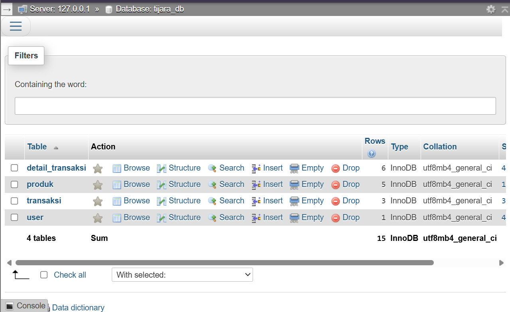

# TIJARA - Marketplace System 🛒

TIJARA adalah sistem marketplace berbasis web yang dirancang untuk mengelola produk, transaksi, dan interaksi antara penjual dan pembeli secara efisien. Proyek ini dibangun menggunakan PHP Native untuk menunjukkan pemahaman mendalam tentang logika pemrograman web dan manajemen database.

## 🚀 Fitur Utama
- **Manajemen Produk:** Tambah, edit, dan hapus data produk (CRUD).
- **Sistem Keranjang:** Fitur belanja yang interaktif bagi pengguna.
- **Manajemen Transaksi:** Pencatatan riwayat pembelian secara sistematis.
- **Dashboard Admin:** Area khusus untuk pengelolaan data marketplace.

## 🛠️ Teknologi yang Digunakan
- **Backend:** PHP Native
- **Database:** MySQL
- **Server:** XAMPP (Apache)

## 📸 Tampilan Proyek 



---

## ⚙️ Instalasi
1. Clone repository ini:
   ```bash
   git clone [https://github.com/mhasbyarrozy/TIJARA-Marketplace.git](https://github.com/mhasbyarrozy/TIJARA-Marketplace.git)